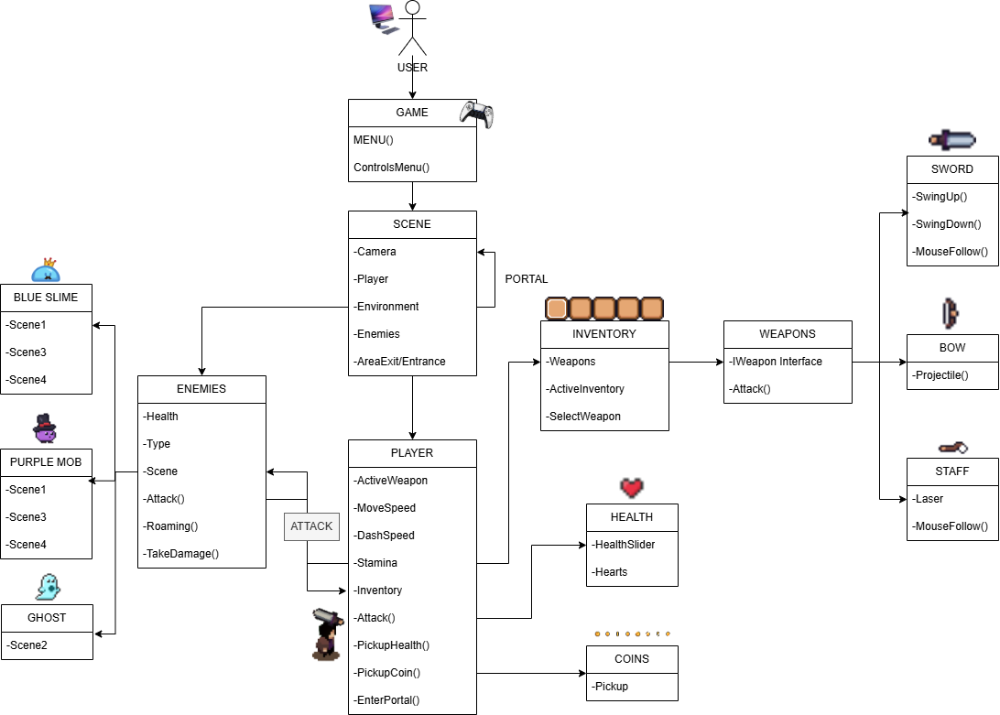
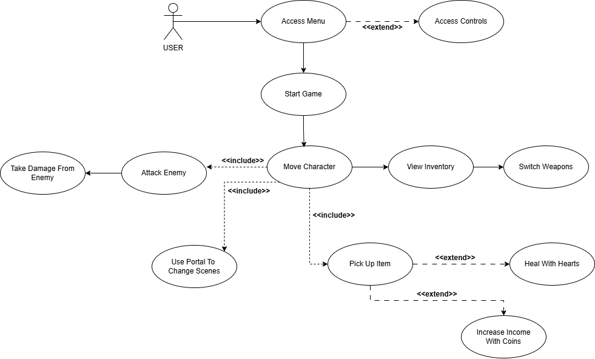
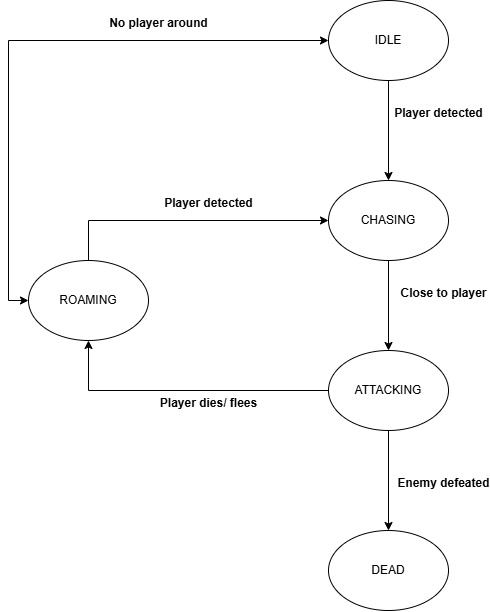

# Little Mighty One

This project is a 2D top-down RPG developed in Unity as part of the *Metode de Dezvoltare Software* course. It includes four interconnected scenes, multiple enemy types, a dynamic weapon and inventory system, player health mechanics, and smooth scene transitions.

## ⚙️ Technologies Used
- Unity 2022.3.6f1
- C# with Visual Studio 2022 & Rider
- Git + GitHub (branches, PRs, issues)
- ChatGPT (AI-assisted debugging and concept learning)
- Task Management : Jira  👉 [Click here for the full Jira backlog](https://andraandruta60.atlassian.net/jira/software/projects/SCRUM/boards/1/backlog?epics=visible&atlOrigin=eyJpIjoiMmYwMWFmOGU0MGU0NGY5M2FiMTMyN2UzZDc4NTEzYTciLCJwIjoiaiJ9)

## 🎮 Game Overview
- Four playable scenes: Scene1 (Blue Slime, Purple Mob), Scene2 (Ghost), Scene 3 and 4 (Maze + Purple Mob)
- Main menu + Controls
- Player movement with idle/run animation
- Weapon system with Sword (melee), Bow (projectile), Staff (laser)
- Active inventory & weapon switching
- Health bar + collectible hearts
- Collectible coins
- Scene transitions with fade effects and player repositioning
- Camera bounds via Cinemachine Confiner
- Visual feedback: glow effects, fade-out on enemy death

## ✅ Evaluation Criteria Coverage

### ✔️ 1. User Stories & Backlog – **2 pts**
- 10+ user stories written and tracked during development  
- Features planned in Jira  
- Examples: "As a player, I want to view and organize my items in an inventory screen so that I can plan my gameplay."

### ✔️ 2. Diagrams – **1 pt**
- Included **UML Class Diagram**
  
  
- Included **UML USE-CASE Diagram**
  
  
- Included **UML STATE Diagram for enemy**
  
  

### ✔️ 3. Source Control (Git) – **2 pts**
- Project versioned on GitHub  
- >=10 commits per contributor  
- Branching used (`feature/`, `bugfix/`), pull requests and merges used actively  
- Example PRs: *“Add sword attack logic”*, *“Fix bug in scene transition”*

### ✔️ 4. Automated Testing – **2 pts**
- We tried using Unity’s Test Framework to automate some parts of the game logic, but ran into bugs and technical difficulties (especially with Play Mode and object interactions). While we didn’t manage to fully implement automated testing, the experience gave us useful insights and we aim to improve this aspect in future updates.

### ✔️ 5. Bug Reporting + Fix via PR – **1 pt**
- Example: “Black screen after scene transition”  
  - Bug logged in backlog  
  - Fix implemented with PR + commit messages  
  - Fix confirmed through gameplay testing

### ✔️ 6. Code Comments & Standards – **1 pt**
- All `.cs` scripts follow C# naming conventions  
- XML-style `/// 
` comments added to classes & methods  
- Folder structure follows Unity best practices (`Scripts/Enemies`, `Scripts/Weapons`, etc.)

### ✔️ 7. Design Patterns – **1 pt**
- Implemented **Singleton Pattern** for:
  - `PlayerController`
  - `UIFade`
  - `EconomyManager`
  - `CameraController`, etc.
- Promotes modular, persistent, and decoupled system logic

### ✔️ 8. Prompt Engineering (AI Tools) – **2 pts**
We used **ChatGPT** as a development assistant to:

- Solve the **black screen bug** during scene transitions
- Understand and apply **`DontDestroyOnLoad`** behavior with nested GameObjects
- Learn **animation state handling** (e.g., idle vs run based on input)
- Apply design patterns correctly (`Singleton<T>`)
- Structure inventory with ScriptableObjects
- Write clean, commented, production-level C# code
- Document code using `summary` comments and maintain consistent naming

> Example prompts:
> - `"How to pass variables between scenes in Unity?"`
> - `"How to create a basic interface-based weapon system?"`
> - `"How to add knockback to an enemy when hit?"`

# ✨ Game Narrative & Core Loop
Little Mighty One is a 2D top-down action RPG where the player must traverse four connected scenes, defeat different types of enemies, and survive using weapons and collectible resources.

## 🧙 Story:
You are the Little Mighty One, a lone hero dropped into an enchanted world infested by corrupted creatures. Starting from a peaceful field now overrun by blue slimes and a purple mob, your goal is to cleanse the land and uncover the dark force behind the invasion.

## ⚔️ Gameplay Loop:

#### Explore Scene1: Fight blue slimes and a purple mob, collect hearts and coins, swap between sword, bow, and staff.

- From Scene1, you can enter a portal to Scene3: the maze. After escaping, you are rewarded with lots of resources.

#### Move through a portal to Scene2 where a ghost enemy patrols.

- From Scene2, you can progress to Scene4, which is another maze full of secrets and things to uncover.

If you die, you respawn in Scene1.

Defeat enemies → collect coins and hearts → survive longer → switch weapons → repeat.

Dynamic inventory and smooth fade-based scene transitions guide the player forward.

## 📁 Repository Structure Highlights
- `Assets/Scripts`: Organized in folders by role (Player, Enemies, Management)
- `Scenes/`: Contains `Scene1` and `Scene2`
- `Prefabs/`: Contains enemies, weapons, coins, hearts
- `Materials/`: Used for torches and death effects

## 📎 *Access the full documentation here*:   [📄 Project Documentation](https://docs.google.com/document/d/1FYkPNgxL9V46p0bNFUEcMQqGQ7LHoYQzP_VeqZISp4U/edit?usp=sharing)

### Includes:

- [x] UML & workflow diagrams

- [x] User stories

- [x] Bug reports

- [x] Design choices

- [x] Prompt engineering use

- [x] Evaluation criteria checklist

## 📌 Contributors
Tunaru Ioana Alexandra - 232

Andruță Andra Mihaela - 232

Jiglău Fabrizzio - 233

Iordache Tudor Dimitrie - 233

## 📽 Demo
A recorded gameplay demo (offline) is provided along with this repository.

